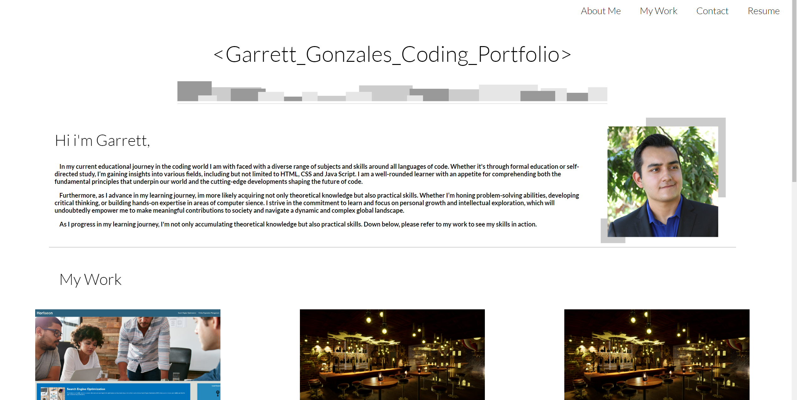

# My-Coding-Portfolio

## User Story

AS A student

I WANT to build a fully functional portfolio website

SO THAT my website can present the work Ive developed for future employers

## Acceptance Criteria

GIVEN a that the website is fully functionable 

WHEN I successfully assemble a working website with links

WHEN I create spaces for my past projects

WHEN I create a good-looking design

WHEN I have images on the application

When I have created UI scrolls when you press the Nav bar buttons

When I have created a good looking contact section with my basic contact info

When I have linked up my project 1 through a link in the work section

When I have learned how to use the flex properties to create a row of boxes in my work section

WHEN I the website is pushed out and works with ease

## Deployed URL 

url

## Website Screenshot

